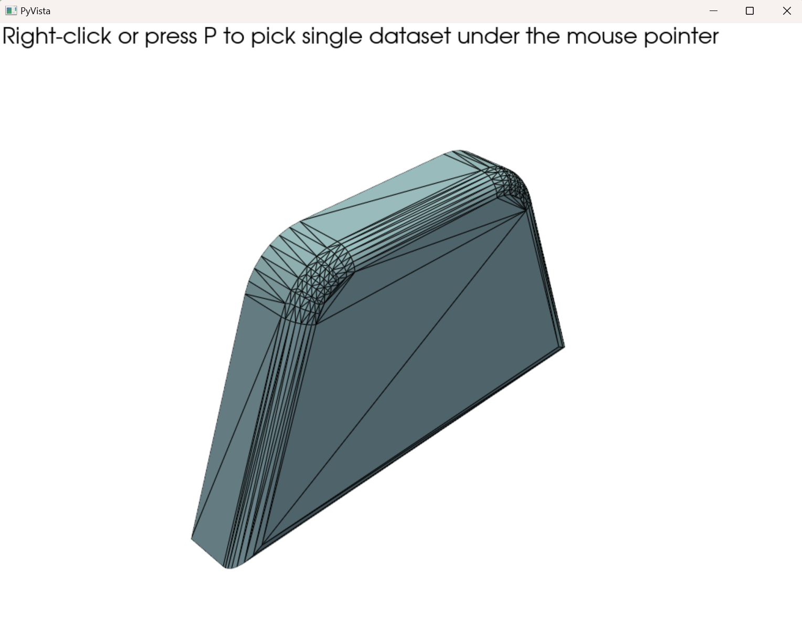
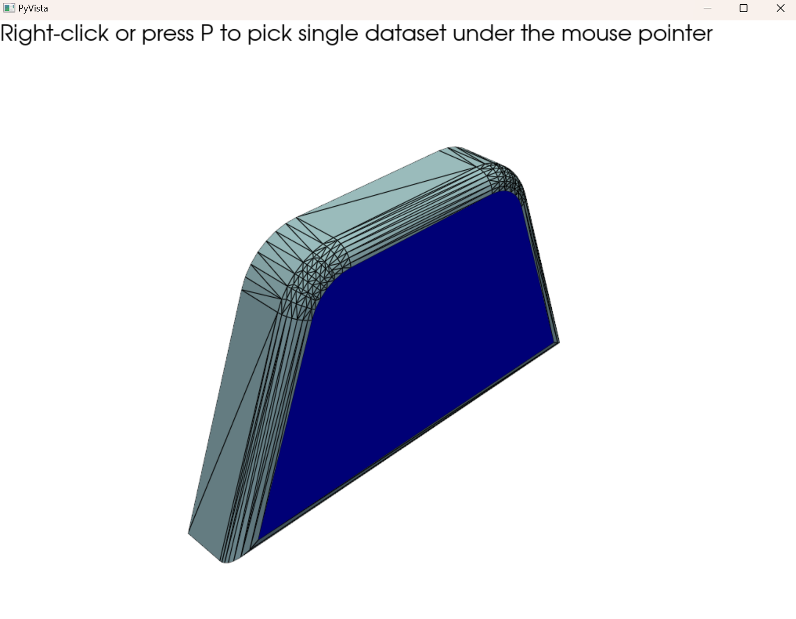

# STEP Face Extractor & Visualizer

이 프로젝트는 STEP(CAD) 파일을 불러와 각 면(Face)을 STL 파일로 분리하고,  
PyVista를 이용해 3D로 시각화하며, 사용자가 특정 면을 클릭하면  
해당 면만 하이라이트되도록 하는 Python 기반의 도구입니다.


## 📷 시각화 예시

<table align="left">
  <tr>
    <td align="center">
      <br>
      <sub>기본 뷰</sub>
    </td>
    <td align="center">
      <br>
      <sub>하이라이트 뷰</sub>
    </td>
  </tr>
</table>


## 📌 기능 소개

- STEP 파일 내 개별 Face(면)를 추출하여 STL로 저장
- PyVista를 통해 3D 렌더링 및 마우스 클릭으로 면 선택/하이라이트
- 하이라이트 색상 및 스타일 커스터마이징 가능


## ⚙️ 실행 환경

- Python 3.9 이상  
- Windows 지원  
- **Anaconda 가상환경 사용 권장**


## 📦 환경 세팅
  
### 1. 새 conda 환경 생성

```bash
conda create -n occenv python=3.9
conda activate occenv
```

### 2. 필수 라이브러리 설치

```bash
conda install -c conda-forge pythonocc-core=7.8.1.1 pyvista pyvistaqt pillow openpyxl

```
  
  


## 🚀 실행 방법
  
### 1. STEP 파일 준비
STEP 파일을 프로젝트 루트 디렉터리에 위치시킵니다.
(또는 `--step` 옵션으로 다른 파일 경로 지정 가능)

### 2. Python 파일 실행

```bash
python test.py --step test.STEP --out faces_out
```

- `--step`: 변환할 STEP 파일 경로 (기본값: `test.STEP`)  
- `--out`: STL 파일이 저장될 디렉터리명 (기본값: `faces_out`)


### 3. 3D 시각화 조작법

- **마우스 우클릭: 파란색으로 하이라이트 표시**
- 마우스 좌클릭 드래그: 회전  
- 휠 스크롤: 줌 인/아웃  
- `P` 키: Pick 모드 토글  

  
### 📏 부피 계산 cal_fine.py
cal_fine.py 는 아래 순서로 가능한 한 정확한 부피를 구합니다.

1. tolerance 내 틈을 자동 봉합(Sewing)
2. 닫힌 Solid 이 만들어지면 실부피 계산
3. 실패 시 pitch 해상도로 Voxelize → 근사 부피 산출


bounding box (x,y,z 최소 최대로 부피 구하기)
```bash
python cal_fine.py --step test.STEP --bbox
```

기본 측정 (bounding box 버젼보다 정확함)
```bash
python cal_fine.py --step test.STEP
```

단위 변경(mm3, cm3, m3 가능)
```bash
python cal_fine.py --step test.STEP --unit cm3
```

여러 기능 쓰는 예시
```bash
python cal_fine.py --step test.STEP --tol 0.05 --pitch 0.5 --unit cm3 --bbox
```

| 옵션      | 설명                                   | 기본값 |
|-----------|----------------------------------------|--------|
| `--step`  | STEP 파일 경로 <br>*(필수)*             | –      |
| `--tol`   | Sewing 허용 틈&nbsp;(mm)                | `0.05` |
| `--pitch` | Voxel 격자 간격&nbsp;(mm)               | `0.5`  |
| `--unit`  | 출력 단위 `mm3 / cm3 / m3`              | `cm3`  |
| `--bbox`  | Bounding‑Box 부피도 함께 출력           | 꺼짐   |
| `--show`  | PyVista 로 원본 + Voxel 결과 시각화     | 꺼짐   |

[OK] exact volume = 134.568 cm3
[Voxel] pitch=0.5 mm → 136.890 cm3  (△ 1.73 %)

--tol 값이 너무 작으면 Solid 생성에 실패할 수 있으니
0.05 → 0.1 → 0.2 mm 등 단계적으로 조정해 보세요.

## 🧪 테스트된 환경
  
- Python 3.9  
- Windows 11  
- PyVista 0.42.0  
- pythonocc-core 7.8.1.1  

  
  


## 📬 문의
  
오류나 개선 사항은 GitHub Issues 또는 이메일로 연락해주세요.

  


## 📝 License & Notice
  
이 프로젝트는 **기술 평가 및 면접용 과제**로 작성되었으며,  
**비상업적 목적의 평가 외 사용은 금지**됩니다.

본 프로젝트는 다음 오픈소스 라이브러리를 포함하고 있습니다:

- [PyVista (MIT License)](https://github.com/pyvista/pyvista): Python 기반의 3D 시각화 라이브러리로, VTK 위에서 동작하며 직관적인 API를 제공합니다.
- [pythonOCC (LGPL-3.0)](https://github.com/tpaviot/pythonocc-core): STEP/IGES 등의 CAD 파일을 파싱할 수 있는 Python 바인딩 라이브러리로, OpenCASCADE를 기반으로 합니다.

각 라이브러리의 라이선스를 준수하여 사용하였습니다.
